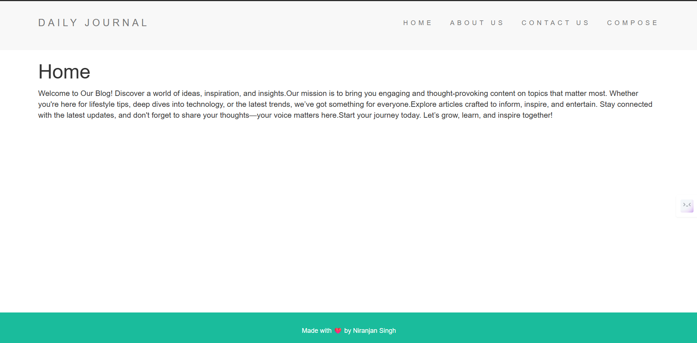
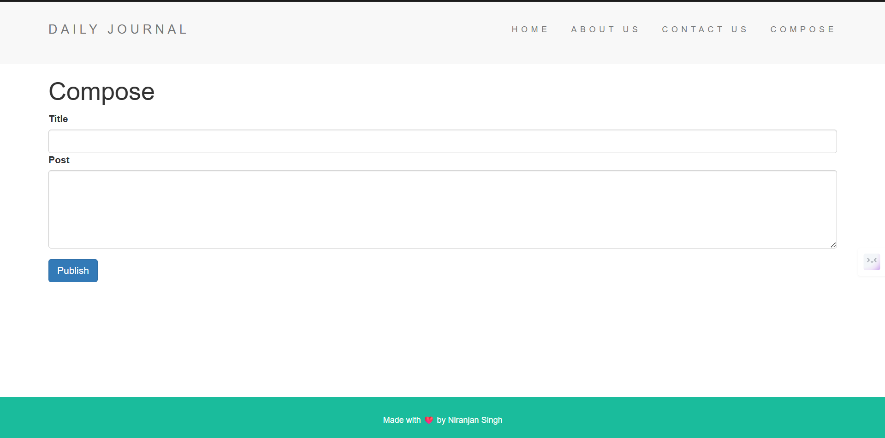

# 📝 Daily Journal

**Daily Journal** is a minimalist web application that allows users to compose, view, and manage daily blog posts. Designed for simplicity and ease of use, it serves as a personal space for journaling or blogging on the go.

---

## ✨ Features

- 🖊️ Write and publish blog entries with title and content
- 📄 View all journal entries on the home page
- 🔍 Navigate to full post pages using dynamic URLs
- 🧼 Clean and responsive design using EJS templates
- 💾 Optional database integration using MongoDB (for persistent storage)

---

## 🛠️ Tech Stack

| Category      | Technology               |
|---------------|---------------------------|
| **Frontend**  | HTML, CSS, Bootstrap      |
| **Backend**   | Node.js, Express.js       |
| **Templating**| EJS                       |
| **Database**  | MongoDB with Mongoose *(optional)* |

---
## 📸 Screenshots

